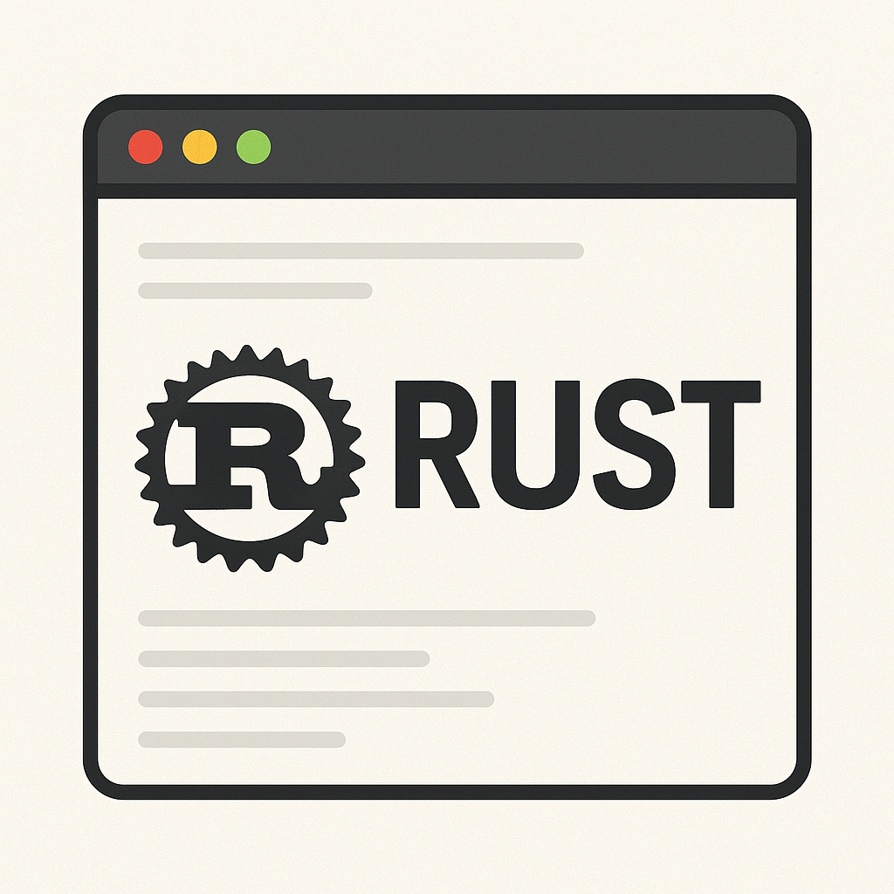

<!-- PROJECT SHIELDS -->
[![Contributors][contributors-shield]]()
<!-- [![LinkedIn][linkedin-shield]][linkedin-url] -->

<!-- PROJECT LOGO -->
 

  

  <h3 align="center">Geditor</h3>

  

    Personal project based on Rust
     
    <a href="https://github.com/paun-cristian/Geditor/issues">Report Bug</a>
  

<!-- TABLE OF CONTENTS -->
## Table of Contents

* [About the Project](#about-the-project)
  * [Built With](#built-with)
* [Contributing](#contributing)
* [Let's Get Social](#lets-get-social)
* [Contact](#contact)
* [Acknowledgements](#acknowledgements)

<!-- ABOUT THE PROJECT -->
## About The Project

Every project starts from a certain passion. This one started as my first RUST project, from which I learned many things about this programming language.

### Built With

* [Rust](https://rust-lang.org/)

<!-- CONTRIBUTING -->
## Contributing

Contributions are what transformed the open source into such an amazing place to be learn, teach, and create. Any contributions you make are **greatly appreciated**.

1. Fork the project
2. Create your branch (`git checkout -b my-branch`)
3. Commit your changes (`git commit -m 'Add: feature X`)
4. Push to the branch (`git push origin feature X`)
5. Open a Pull Request (PR)

<!-- LET'S GET SOCIAL -->
## Let's Get Social

* [Facebook](https://www.facebook.com/FilthyNea)
* [Github](https://github.com/paun-cristian)
* [Instagram](https://www.instagram.com/__pauncristian/)
* [Youtube](https://www.youtube.com/@cristi_bbsw)

<!-- CONTACT -->
## Contact

Paun Cristian - pauncristianafc@gmail.com

Project Link: [https://github.com/paun-cristian/Geditor](https://github.com/paun-cristian/Geditor)

<!-- ACKNOWLEDGEMENTS -->
## Acknowledgements
* [GitHub Pages](https://pages.github.com)
* [Rust Page](https://rust-lang.org/)

<!-- MARKDOWN LINKS & IMAGES -->
[contributors-shield]: https://img.shields.io/badge/contributors-1-orange.svg?style=flat-square
[linkedin-shield]: https://img.shields.io/badge/-LinkedIn-black.svg?style=flat-square&logo=linkedin&colorB=555
[linkedin-url]: https://linkedin.com/in/othneildrew
[product-screenshot]: ./images/projects/portfolio.jpg
